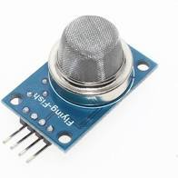

// PAGE TITLE
= Documentation Détecteur de Gaz

// OVERVIEW SECTION STARTS
[#overview]
--

[float]
=== Description
// Describe what this Reference term does, and what it is used for	►►►►► THIS SECTION IS MANDATORY ◄◄◄◄◄
Réceptionne le taux de gaz dans une salle. Les données sont reçus par un M5StickC sur le pin 36. 
[%hardbreaks]

[%hardbreaks]

[float]
=== Setup
`void setup()`

[#howtouse]
--

[float]
=== Code Setup
Initialisation du M5StickC auquel est relié ce capteur, la lecture de données sur le pin 36 ainsi que le Bluetooth.

[source,arduino]
----
 M5.begin();
 SerialBT.begin("BtGaz"); //Bluetooth device name
 M5.Lcd.setCursor(10, 10);
 M5.Lcd.println(" Taux Gaz :");
 pinMode(36,INPUT);
----
[%hardbreaks]

[float]
=== Loop
`void loop()`

[#howtouse]
--

[float]
=== Code Loop
Programme qui tourne en permanance sur le M5StickC. Il lis les valeurs du pin 36 et les transmet via Bluetooth
Il y a également la valeur du capteur affiché sur l'écran du M5StickC

[source,arduino]
----
  int gaz;
  //Récupération de la valeur du capteur sur le pin 36
  gaz=analogRead(36);
  Serial.println("GAZ Level :");
  // Affichage dans le terminal pour vérification 
  Serial.println(gaz);
  // Envoi de la donnée en bluetooth 
  SerialBT.println(gaz);
  //Placement du curseur sur l'écran LCD
  M5.Lcd.setCursor(25, 70);
  //Affichage de la donnée sur l'écran LCD
  M5.Lcd.print(gaz);
  delay(2000);
----
[%hardbreaks]

--
[#see_also]
--

[float]
=== Voir d'autres documentations

[role="language"]
* #LIEN :# link:https://github.com/LENSAlex/ProjetIotia/blob/Code_Capteur/documentation/DocumentationHaut_parleur.adoc[Documentation Haut Parleur]
* #LIEN :# link:https://github.com/LENSAlex/ProjetIotia/blob/Code_Capteur/documentation/DocumentationPorte.adoc[Documentation Porte]
* #LIEN :# link:https://github.com/LENSAlex/ProjetIotia/blob/Code_Capteur/documentation/DocumentationPIR.adoc[Documentation PIR]
* #LIEN :# link:https://github.com/LENSAlex/ProjetIotia/blob/Code_Capteur/documentation/DocumentationPIR_sortie.adoc[Documentation PIR Sortie]

