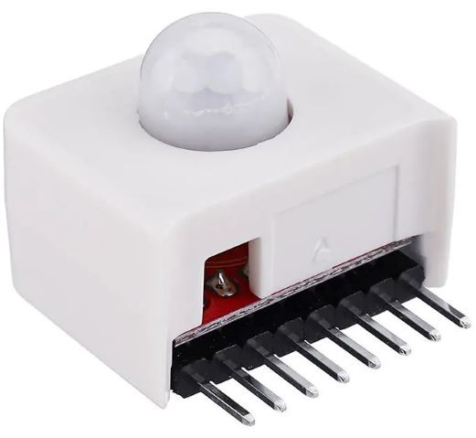

// PAGE TITLE
= Documentation PIR Sortie

// OVERVIEW SECTION STARTS
[#overview]
--

[float]
=== Description
Renvoit 1 ou 0 sur le pin 0 en fonction de si une personne est sortie ou non. Les données sont lues par un M5StickC
[%hardbreaks]

[%hardbreaks]

[float]
=== Setup
`void setup()`

[#howtouse]
--

[float]
=== Code Setup
Initialisation du M5StickC auquel est relié ce capteur, la lecture de données sur le pin 36 ainsi que le Bluetooth.

[source,arduino]
----
  //Initialisation du bluetooph nom du peripherique
    SerialBT.begin("PirSortieBL");
    
  // put your setup code here, to run once:
    M5.begin();
    M5.Lcd.fillScreen(BLACK);
    M5.Lcd.setCursor(15, 15, 2);M5.Lcd.println("PIR Etat");
    pinMode(36,INPUT_PULLUP);
----
[%hardbreaks]

[float]
=== Loop
`void loop()`

[#howtouse]
--

[float]
=== Code Loop
Programme qui tourne en permanance sur le M5StickC. Il lis les valeurs du pin 36 et les transmet via Bluetooth

[source,arduino]
----
  if(digitalRead(36)==1){
    M5.Lcd.setCursor(25, 70, 7);M5.Lcd.print("1");
    //Ici j envoie qu'un passage a été détecté = 1
    SerialBT.println("1");
    Serial.println("1");
    delay(1000);
  }
  else{
    M5.Lcd.setCursor(25, 70, 7);M5.Lcd.print("0");
    //Ici j envoie qu'un passage a été détecté = 0
    SerialBT.println("0");
    Serial.println("0");
----
[%hardbreaks]

--
[#see_also]
--

[float]
=== Voir d'autres documentations

[role="language"]
* #LIEN :# link:https://github.com/LENSAlex/ProjetIotia/blob/Code_Capteur/documentation/DocumentationHaut_parleur.adoc[Documentation Haut Parleur]
* #LIEN :# link:https://github.com/LENSAlex/ProjetIotia/blob/Code_Capteur/documentation/DocumentationGaz.adoc[Documentation détecteur de gaz]
* #LIEN :# link:https://github.com/LENSAlex/ProjetIotia/blob/Code_Capteur/documentation/DocumentationPorte.adoc[Documentation Porte]
* #LIEN :# link:https://github.com/LENSAlex/ProjetIotia/blob/Code_Capteur/documentation/DocumentationPIR.adoc[Documentation PIR entrée]

