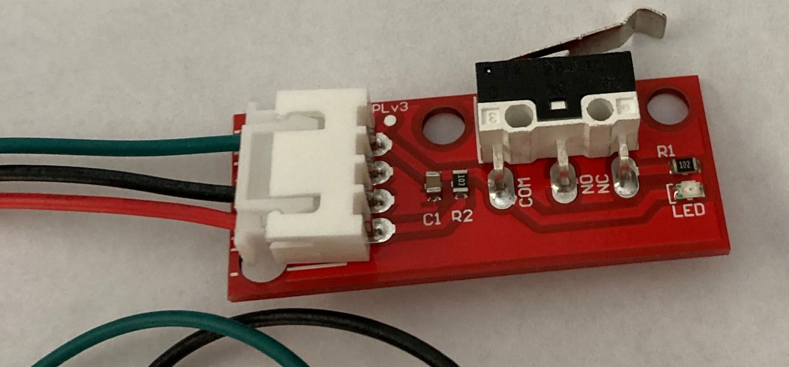

// ARDUINO LANGUAGE REFERENCE TAGS (above)   ►►►►► ALWAYS INCLUDE IN YOUR FILE ◄◄◄◄◄
// title will show up in the Index of all Reference terms
// If the title is an operator write it out in words in title_expanded
// categories: Pick between Structure, Variable or Function
// The subcategory within the ones available in the index ("Digital I/O", "Arithmetic Operators")

// PAGE TITLE
= Documentation Détection Porte 

// OVERVIEW SECTION STARTS
[#overview]
--

[float]
=== Description
// Describe what this Reference term does, and what it is used for	►►►►► THIS SECTION IS MANDATORY ◄◄◄◄◄
Renvoit 1 ou 0 sur le pin 0 en fonction de si la porte est fermée ou non. Les données sont lues par un M5StickC
[%hardbreaks]

[%hardbreaks]

[float]
=== Setup
`void setup()`

[#howtouse]
--

[float]
=== Code Setup
Initialisation du M5StickC auquel est relié ce capteur, la lecture de données sur le pin 0 ainsi que le Bluetooth.

[source,arduino]
----
  // Initialize the M5StickC object
  M5.begin();
  SerialBT.begin("fenetreBt"); //Bluetooth device name
  // LCD display
  M5.Lcd.setCursor(0,10);
  pinMode(0, INPUT);
----
[%hardbreaks]

[float]
=== Loop
`void loop()`

[#howtouse]
--

[float]
=== Code Loop
Programme qui tourne en permanance sur le M5StickC. Il lis les valeurs du pin 0 et les transmet via Bluetooth

[source,arduino]
----
  int info = 0;
  // read the state of the pushbutton value
  Serial.println("Port A0: ");
  info = digitalRead(0);
  Serial.println(info);
  if(info == 0){
    M5.Lcd.setCursor(0,10);
    M5.Lcd.print("Fermer");
  }
  if(info == 1){
    M5.Lcd.setCursor(0,10);
    M5.Lcd.print("Ouvert");
  }
// envoi si la porte est ouverte ou non. 1== ouvert/ 0 == fermé
  SerialBT.println(info);
  delay(1000);
----
[%hardbreaks]

--
[#see_also]
--

[float]
=== Voir d'autres documentations

[role="language"]
* #LANGUAGE# link:../Speaker/SpeakerBeep[Documentation Haut Parleur]
* #LANGUAGE# link:../gaz/gaz/GAZ[Documentation détecteur de gaz]

