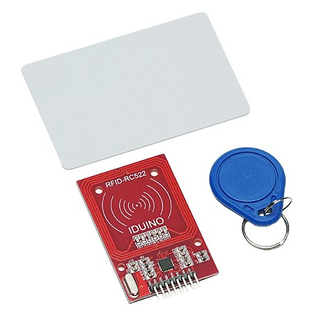
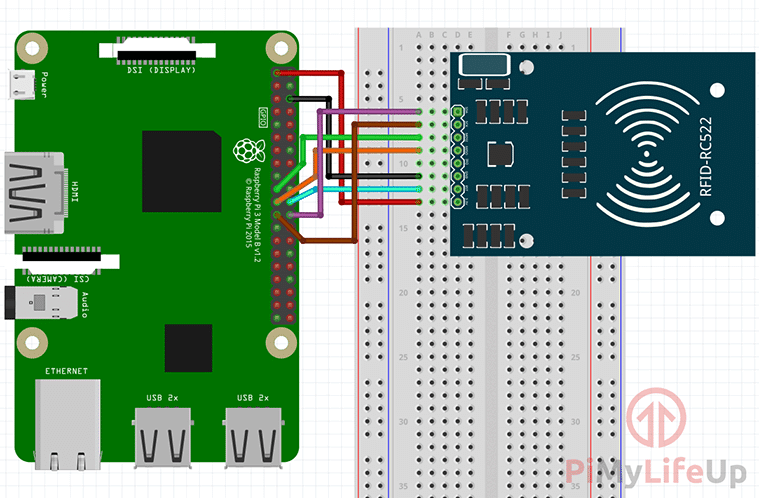

// PAGE TITLE
= Documentation Lecteur RFID

// OVERVIEW SECTION STARTS
[#overview]
--

[float]
=== Description
// Describe what this Reference term does, and what it is used for	►►►►► THIS SECTION IS MANDATORY ◄◄◄◄◄
Lit les puces RFID qui sont dans les cartes étudiante pour récuperer l'identifiant de la carte (IUD)
[%hardbreaks]

[%hardbreaks]

[float]
=== Branchement
// Describe what this Reference term does, and what it is used for	►►►►► THIS SECTION IS MANDATORY ◄◄◄◄◄
Branchement du lecteur RFID sur le Raspberry
[%hardbreaks]

[%hardbreaks]

[float]
=== Librairie Python
[source,python]
----
#gpio raspberry
import RPi.GPIO as GPIO
#librairie lecteur RFID
import MFRC522
import signal
#librairie écran lcd
import drivers
#librairie pour client mqtt
import paho.mqtt.client as mqtt
#timer
from time import sleep
----
[%hardbreaks]

[#howtouse]
--

[float]
=== Initialisation
Initialisation du client MQTT, des PINS GPIO pour allumer la led en vert ou en rouge et de l'écran LCD.

[source,python]
----
#adresse ip broker mqtt
broker_address="192.168.143.136"

#nomde notre client mqtt
client = mqtt.Client("RFID_IUD")

#initialisation des pin GPIO
GPIO.setmode(GPIO.BOARD)
#variable pour le driver lcd
display = drivers.Lcd()
#lecture mqtt
continue_reading = True

#couleur pour la led 
GREEN = 11
RED = 13

#setup des pins pour dire qu'ils sont en sortie
GPIO.setup(GREEN, GPIO.OUT)
GPIO.setup(RED, GPIO.OUT)
----
[%hardbreaks]

[float]
=== Focntion While
Focntion qui tourne en boucle.
Elle attend qu'un tag RFID soit lu pour savoir si l'identifiant est correct afin de laisser l'accès à la salle.
[source,python]
----
while continue_reading:
    #extinction des pins
    GPIO.output(GREEN, GPIO.LOW)
    GPIO.output(RED, GPIO.LOW)
    display.lcd_display_string(" Passer le tag:   ",1)
    display.lcd_display_string("      RFID",2)
	
    #Detecte les tags
    (status,TagType) = MIFAREReader.MFRC522_Request(MIFAREReader.PICC_REQIDL)

    #Une carte a été detecté
    if status == MIFAREReader.MI_OK:
        print ("Carte detectee")
    
    #Recuperation UID
    (status,uid) = MIFAREReader.MFRC522_Anticoll()

    if status == MIFAREReader.MI_OK:
	display.lcd_clear()
	#integration de l'iud dans une variable string
	UID = str(uid[0])+str(uid[1])+str(uid[2])+str(uid[3])
	#print (UID)
	display.lcd_display_string("UID:"+UID,1)
	#affiche l'IUD
        print ("UID de la carte : "+str(uid[0])+"."+str(uid[1])+"."+str(uid[2])+"."+str(uid[3]))
	sleep(1)
	
	if UID == "21713017272":
		#connection au broker
		client.connect(broker_address)
		#publie sur le topic
		client.publish("/batiment/etages/salles/UID",UID)
		display.lcd_clear()
		#accès autoriser et allume le led en vert
		display.lcd_display_string("      Acces",1)
		display.lcd_display_string("    Autorisee",2)
		GPIO.output(GREEN, GPIO.HIGH)
		sleep(1)
	else:
		#connection au broker
		client.connect(broker_address)
		#publie sur le topic
                client.publish("/batiment/etages/salles/UID",UID)
		#accès autoriser et allume le led en rouge
		display.lcd_clear()
		display.lcd_display_string("     Acces",1)
                display.lcd_display_string("    Refusee",2)
		GPIO.output(RED, GPIO.HIGH)
		sleep(1)

----
[%hardbreaks]

--
[#see_also]
--

[float]
=== Voir d'autres documentations

[role="language"]
* #LIEN :# link:https://github.com/LENSAlex/ProjetIotia/blob/Code_Capteur/documentation/DocumentationHaut_parleur.adoc[Documentation Haut Parleur]
* #LIEN :# link:https://github.com/LENSAlex/ProjetIotia/blob/Code_Capteur/documentation/DocumentationPorte.adoc[Documentation Porte]
* #LIEN :# link:https://github.com/LENSAlex/ProjetIotia/blob/Code_Capteur/documentation/DocumentationPIR.adoc[Documentation PIR]
* #LIEN :# link:https://github.com/LENSAlex/ProjetIotia/blob/Code_Capteur/documentation/DocumentationPIR_sortie.adoc[Documentation PIR Sortie]

