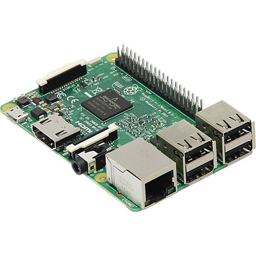

// PAGE TITLE
= Documentation du code Python sur le Raspberry Pi

// OVERVIEW SECTION STARTS
[#overview]
--

[float]
=== Description
Réception des données envoyé par les capteurs. Analyse et r'envoie à un M5tack si y a des alertes à faire. Il envoie également toutes les données à un broker MQTT.
[%hardbreaks]

[%hardbreaks]

[float]
=== Librairies à Installer
----
sudo python3 –m pip install pybluez
sudo python3 –m pip install bluepy
sudo python3 –m pip install paho-mqtt
----

[#howtouse]
--

[float]
=== Les importations de librairies 
----
from bluetooth import *
import socket
import tkinter as tk
from datetime import datetime
import time
import re
import paho.mqtt.client as mqtt
----

[#howtouse]
--

[float]
=== Code python
Ce programme va permettre de recevoir les données venant du capteur de gaz, de fenêtre et des PIR. Il va ensuite les analyser et renvoyer si besoin des alertes à un M5Stack. Le programme permet également d'envoyer les données à un broker MQTT. 

[source,python]
----
broker_address="192.168.143.136"
client = mqtt.Client("capteur")
now=datetime.now()
date_time=now.strftime("%Y/%d/%m %H:%M:%S")
dat=str(date_time)
print("Recherche des appareils BT ")
nearby_devices=discover_devices(lookup_names = True)
print("found %d devices" % len(nearby_devices))
for name, addr in nearby_devices:
    print(" %s - %s" % (addr, name))
target_name = "fenetreBL"
for name, addr in nearby_devices:
    if target_name == addr:
        target_adress = addr
        print("OK_name_server\n")
        break
for name, addr in nearby_devices:
    if name == '50:02:91:8D:DC:56' :
        print("OK_adr_mac\n")
        break

client_socket_haut_parleur=socket.socket(socket.AF_BLUETOOTH,socket.SOCK_STREAM, socket.BTPROTO_RFCOMM) #m5Stack
client_socket_haut_parleur.connect(("84:0D:8E:3D:3C:56",1))

client_socket_gaz=socket.socket(socket.AF_BLUETOOTH,socket.SOCK_STREAM, socket.BTPROTO_RFCOMM)
client_socket_gaz.connect(("50:02:91:8D:10:36",1))
client_socket_fenetre=socket.socket(socket.AF_BLUETOOTH,socket.SOCK_STREAM, socket.BTPROTO_RFCOMM)
client_socket_fenetre.connect(("50:02:91:8D:DC:56",1))
client_socket_pir=socket.socket(socket.AF_BLUETOOTH,socket.SOCK_STREAM, socket.BTPROTO_RFCOMM)
client_socket_pir.connect(("24:A1:60:46:AD:3E",1))

def signal_handler(sig, frame):
    print('You pressed Ctrl+C!')
    client_socket_gaz.close()
    client_socket_haut_parleur.close()
    client_socket_fenetre.close()
    client_socket_pir.close()
    sys.exit(0)

signal.signal(signal.SIGINT, signal_handler)

while True:
    size = 1024
    #Reception data pour gaz
    data_gaz = str(client_socket_gaz.recv(size))
    res_gaz = re.sub(r"[^Z0-9]","",data_gaz)
    dataGaz = res_gaz[0:3]
    print(dataGaz)
    sleep(1)
    client.connect(broker_address)
    client.publish("/paho/gaz", dataGaz)
    #Reception data pour fenetre
    data_fenetre = str(client_socket_fenetre.recv(size))
    res_fenetre = re.sub(r"[^Z0-9]","",data_fenetre)
    datafentre = res_fenetre[0:1]
    #Reception data pour pir
    data_pir = str(client_socket_pir.recv(size))
    res_pir = re.sub(r"[^Z0-9]","",data_pir)
    data_pir = res_pir[0:1]
    sleep(1)
    client.connect(broker_address)
    client.publish("/paho/pir", data_pir)
    print(datafentre)
    sleep(1)
    client.connect(broker_address)
    client.publish("/paho/fenetre", datafentre)   
    
    if datafentre == "0" and dataGaz > "210":
        print("ferme")
        msg=("GazAlerte").encode('utf-8');
        client_socket_haut_parleur.send(msg);
        time.sleep(5)
   
    print("Pir" + data_pir)
    if data_pir == "1":
        print("dedans pir");
        msg=("PirEntreeBL").encode('utf-8');
        client_socket_haut_parleur.send(msg);
        time.sleep(2)

client_socket_gaz.close()

client_socket_haut_parleur.close()

client_socket_fenetre.close()
client_socket_pir.close()
----
[%hardbreaks]

[float]
=== Voir d'autres documentations

[role="language"]
* #LIEN :# link:https://github.com/LENSAlex/ProjetIotia/blob/Code_Capteur/documentation/DocumentationHaut_parleur.adoc[Documentation Haut Parleur]
* #LIEN :# link:https://github.com/LENSAlex/ProjetIotia/blob/Code_Capteur/documentation/DocumentationPorte.adoc[Documentation Porte]
* #LIEN :# link:https://github.com/LENSAlex/ProjetIotia/blob/Code_Capteur/documentation/DocumentationPIR.adoc[Documentation PIR]
* #LIEN :# link:https://github.com/LENSAlex/ProjetIotia/blob/Code_Capteur/documentation/DocumentationGaz.adoc[Documentation Gaz]